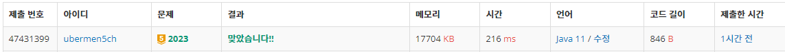
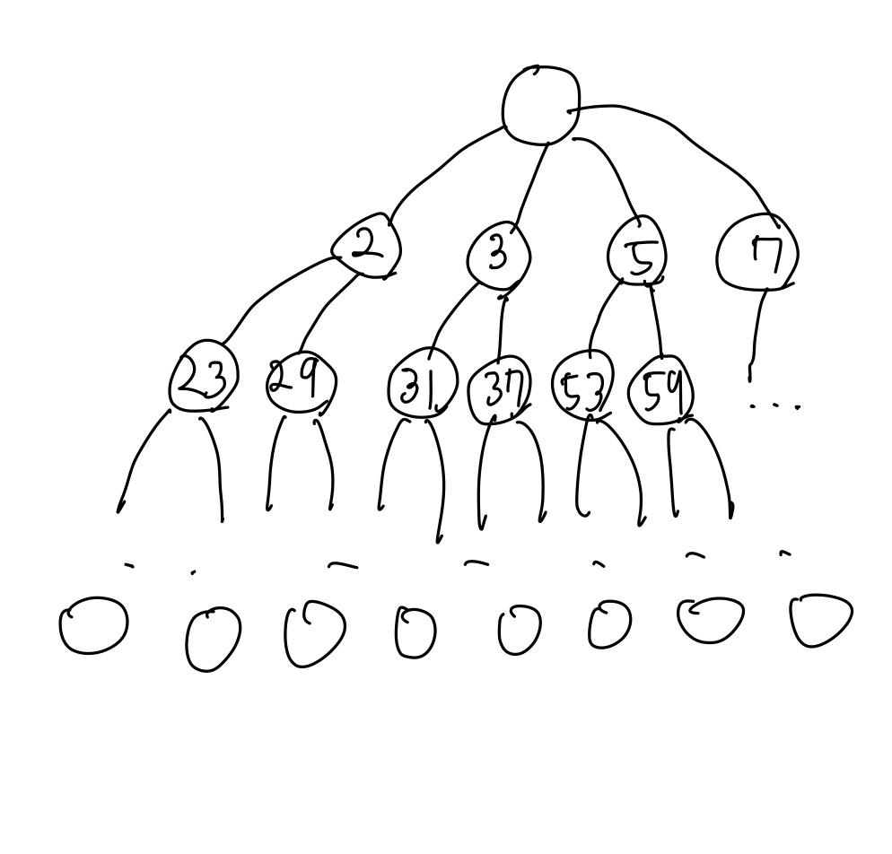

# 신기한 소수

## 스크린 샷

---

## 풀이 방법

### 사고의 흐름

*7331은 소수인데, 신기하게도 733도 소수이고, 73도 소수이고, 7도 소수이다. 즉, 왼쪽부터 1자리, 2자리, 3자리, 4자리 수 모두 소수이다!*

위의 문장에서 아이디어를 얻어냈다. 해당 문제의 상태 공간 트리를 그려보자면 아래와 같다.

그림1 상태공간트리

자세히보면 모두 신기한 소수인것을 알 수 있는데, 트리를 그려나가보면서 발견한 패턴은 이전 depth의 신기한 소수뒤에 0~9의 숫자를 덫붙여가면서 자릿수가 하나 더 큰 신기한 소수를 구할 수 있음을 발견했다.

이러한 점을 이용해서 신기한 소수를 탐색할 때 이전 depth에 신기한 소수 바로 뒤에 0~9까지의 숫자를 붙여서 만들어진 수가 소수인지 판별하고 소수가 아니라면 탐색 범위에서 제외하는 방식으로 가지치기(Pruning)해서 답을 찾아내었다.
